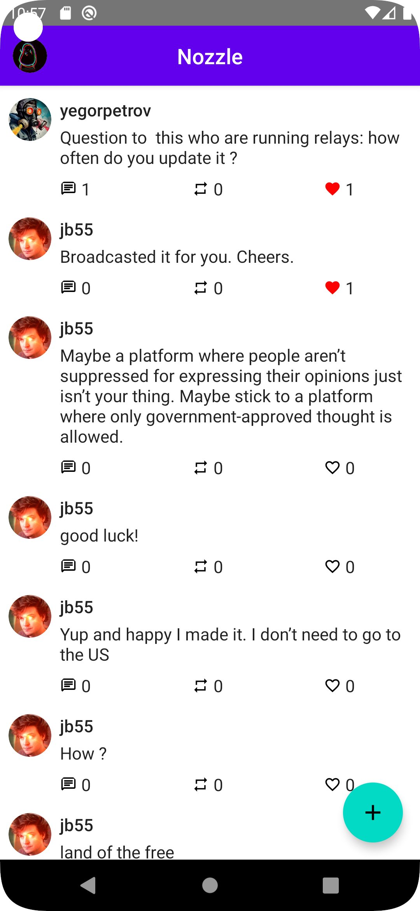
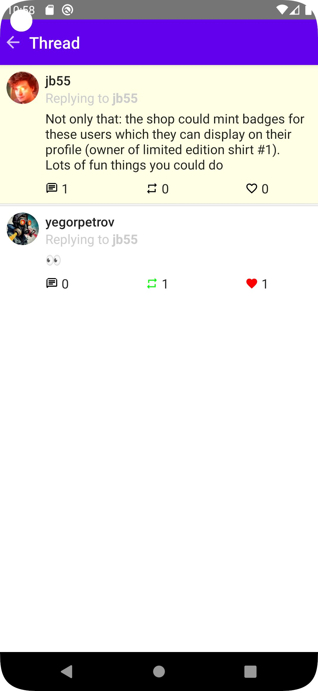
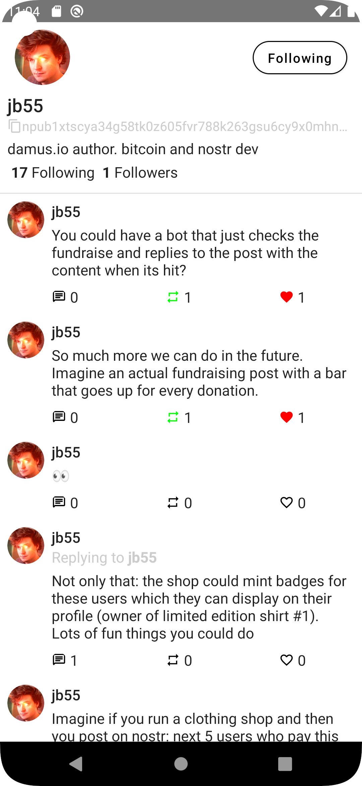

# Nozzle

Nozzle is a Twitter-like nostr client for Android.

## State

This project is in early alpha stage.

I will provide .apk files in the release section of this repository when the software is less buggy.
Meanwhile you can clone this repo and run it in Android Studio if you want test it.

## Features

- [x] Import private key
- [x] Load metadata, contact list and feed
- [x] Show profiles
- [x] Show feed
- [x] Repost and like posts
- [ ] Open whole threads
- [ ] Reply and post
- [ ] nip05 verification
- [ ] Mentions
- [ ] Hashtags
- [ ] Lightning tip button
- [ ] Lightning invoice widget
- [ ] Notifications tab
- [ ] Relay management
- [ ] Mute users
- [ ] Different feed settings
- [ ] Encrypted direct messages

## Preview

I update this Readme infrequently, so these screenshots might be outdated

