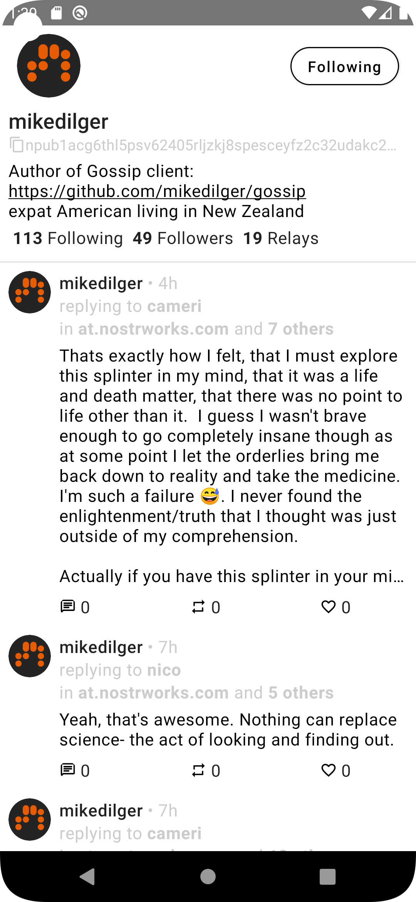

# Nozzle

Nozzle is a Twitter-like nostr client for Android.

## State

This project is in early alpha stage.

## Installation

Go to the [release page](https://github.com/kaiwolfram/Nozzle/releases) and download the latest apk
file or clone this repository and build it yourself

## Screenshots

## Features

- [x] Import private key
- [x] Load metadata, contact list and feed
- [x] Show profiles and follow/unfollow
- [x] Show feed
- [x] Repost and like posts
- [x] Reply and post
- [x] Open whole threads
- [x] Edit profile
- [x] Search bar
- [x] Show on which relays posts have been seen on
- [x] Relay selection for sending posts and replies
- [ ] Use Flows for smoother UX
- [ ] Relay management
- [ ] nip05 verification
- [ ] URL and media preview
- [ ] Profile lists (likes, reposts, following, followers)
- [ ] Mentions
- [ ] Hashtags
- [ ] Quote repost
- [ ] Move to nip18 for reposts
- [ ] Lightning tip button
- [ ] Lightning invoice widget
- [ ] Notifications tab
- [ ] Different feed settings
- [ ] Multiple accounts
- [ ] Mute users
- [ ] Encrypted direct messages
- [ ] Republish saved events to new relays
- [ ] Event signing with NFC card

## License

[MIT licence](https://github.com/kaiwolfram/Nozzle/blob/master/LICENSE)
