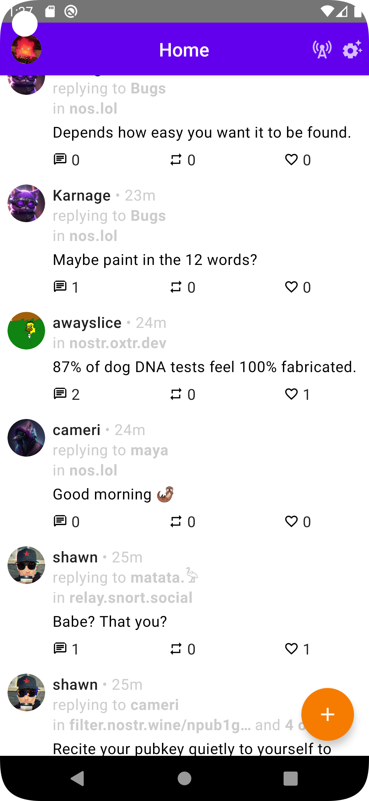

# Nozzle

Nozzle is a Twitter-like nostr client for Android.

## State

This project is in early alpha stage.

I will provide .apk files in the release section of this repository when the software is less buggy.
Meanwhile you can clone this repo and run it in Android Studio if you want to test it.

## Preview

## Features

- [x] Import private key
- [x] Load metadata, contact list and feed
- [x] Show profiles and follow/unfollow
- [x] Show feed
- [x] Repost and like posts
- [x] Reply and post
- [x] Open whole threads
- [x] Edit profile
- [x] Search bar
- [ ] Use Flows for smoother UX
- [ ] nip05 verification
- [ ] URL and media preview
- [ ] Profile lists (likes, reposts, following, followers)
- [ ] Mentions
- [ ] Hashtags
- [ ] Quote repost
- [ ] Move to nip18 for reposts
- [ ] Lightning tip button
- [ ] Lightning invoice widget
- [ ] Notifications tab
- [ ] Different feed settings
- [ ] Multiple accounts
- [ ] Relay management
- [ ] Mute users
- [ ] Encrypted direct messages
- [ ] Republish saved events to new relays
- [ ] Event signing with NFC card
